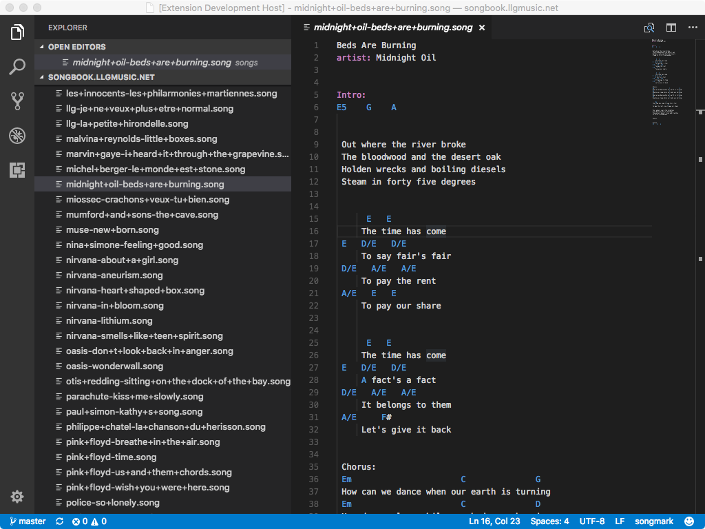

# Songmark for Visual Studio Code

This extension add songmark language support to Visual Studio Code. See [songmark specification](https://github.com/kawane/songmark/)

## Features

* syntax hightlighting

## Extension Settings

## Release Notes

See [CHANGELOG.md](CHANGELOG.md)

## Known Issues

